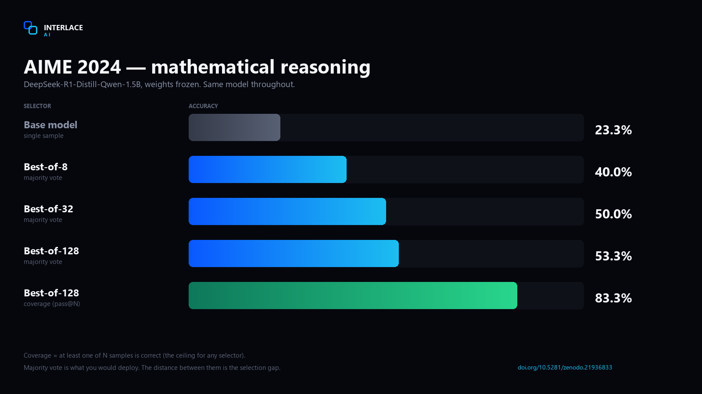
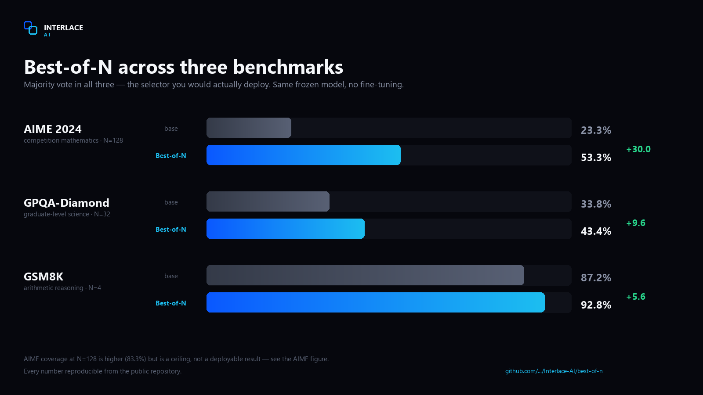
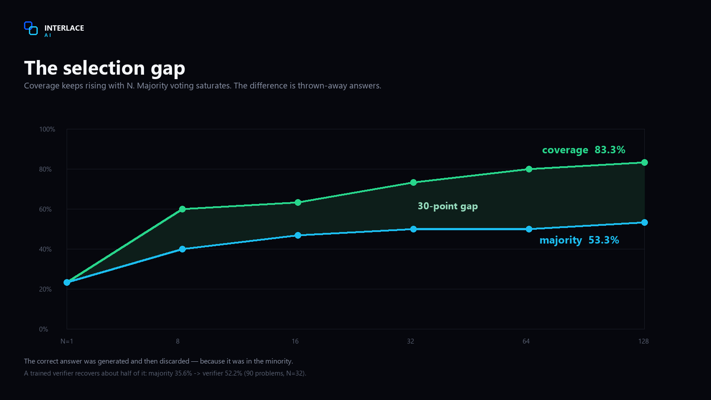

# Best-of-N

> Part of [Interlace AI](../README.md). Code, report and raw outputs for the Best-of-N release.

# Best-of-N — inference-time compute for any language model

**Sample N reasoning trajectories from a frozen model and select the best one.**
No weights are modified. All gains come from *how* the model is used.

Works with **any causal LM** and **any N** — you configure both.

[](https://doi.org/10.5281/zenodo.21936833)
[](../LICENSE)
[](../best-of-n/src/)

---

## What it does

A language model does not produce *an* answer — it produces a distribution over
answers. Sample it once and you get a draw. Sample it N times and the
probability that **at least one** trajectory is correct grows as `1 − (1−p)^N`.

The hard part is picking the right one. This library implements both halves.



Measured on `DeepSeek-R1-Distill-Qwen-1.5B`, **AIME 2024**, weights untouched:

| N | Majority vote | Coverage (pass@N) |
|---:|---:|---:|
| 1 | 23.3% | 23.3% |
| 8 | 40.0% | 60.0% |
| 32 | 50.0% | 73.3% |
| **128** | **53.3%** | **83.3%** |



And across domains:

| Benchmark | Single sample | With Best-of-N | Δ |
|---|---:|---:|---:|
| AIME 2024 | 23.3% | **83.3%** | +60.0 |
| GPQA-Diamond | 33.8% | **43.4%** | +9.6 |
| GSM8K | 87.2% | **92.8%** | +5.6 |

---

## Quickstart

```python
from bestofn import BestOfN

engine = BestOfN("deepseek-ai/DeepSeek-R1-Distill-Qwen-1.5B", n=32)

result = engine.solve("What is the remainder when 7^100 is divided by 13?")
print(result.answer)
print(result.agreement)     # how much the 32 samples agreed
```

Any model, any N:

```python
BestOfN("Qwen/Qwen2.5-Math-7B-Instruct", n=64)
BestOfN("meta-llama/Llama-3.1-8B-Instruct", n=16)
BestOfN("/path/to/your/local/model", n=128)
```

Install:

```bash
pip install torch transformers
pip install vllm     # recommended; required for large N
```

---

## The selection gap

Look at the table above again. At N=128 the model **reaches** the right answer
83.3% of the time, but majority voting only **returns** it 53.3% of the time.



That 30-point difference is the **selection gap** — the correct answer was
generated and then discarded, because it was in the minority.

Majority voting cannot fix this: it is structurally incapable of choosing an
answer most trajectories disagree with. A learned verifier can.

| Selector (N=32, 90 AIME problems) | Accuracy |
|---|---:|
| Self-certainty | 18.9% |
| Majority vote | 35.6% |
| Verifier — argmax trajectory | 43.3% |
| **Verifier — confidence-weighted vote** | **52.2%** |

```python
def my_verifier(problem: str, trajectory: str) -> float:
    return probability_it_is_correct        # 0.0 – 1.0

engine = BestOfN(model, n=32, verifier=my_verifier)
engine.solve(problem, method="verifier")     # +16.6 points over majority
```

---

## Selectors

| Method | Needs | Recovers a minority-correct answer? |
|---|---|:---:|
| `majority` | nothing | No |
| `self_certainty` | log-probs (automatic) | Rarely |
| `verifier` | a verifier callable | **Yes** |
| `verifier_argmax` | a verifier callable | Yes, but noisier |
| `oracle` | the gold answer | Diagnostic ceiling only |

Generation is the expensive part — reusing the samples with another selector is free:

```python
r = engine.solve(problem, n=32)
r.answer                          # majority
r.select_with("self_certainty")
r.covered(gold)                   # was the answer reachable at all? (pass@N)
```

---

## Configuration

```python
BestOfN(
    model="deepseek-ai/DeepSeek-R1-Distill-Qwen-1.5B",
    n=32,                  # your compute budget
    temperature=0.6,       # must be > 0
    top_p=0.95,
    max_tokens=8192,
    extractor="boxed",     # boxed | number | letter | regex | your callable
    backend="auto",        # auto | vllm | transformers
    verifier=None,
)
```

**Full documentation: [USAGE.md](USAGE.md)** — how to choose N, how to plug in a
verifier, how to measure the selection gap on your own task, and the failure
modes worth knowing about.

---

## Verification

The published numbers are not asserted, they are replayed. This repository ships
the trajectories that produced them and a script that feeds them back through
the library:

```bash
python tests/verify_against_measured.py
```

```
Samples per problem (N)          : 32
  majority selection reproduced  : 30/30  (100.0%)
  majority vote, this library    : 63.3%   [report: 63.3%]
  coverage pass@32                 : 76.7%
  gain from Best-of-N            : +31.7 points
PASS - reproduces the published measurements exactly
```

Plus 45 unit tests covering extraction, normalisation, every selector, the
minority-rescue mechanism and error handling — no GPU required:

```bash
python tests/test_selectors.py     # 45 passed, 0 failed
```

---

## Limitations

- **Coverage is a hard ceiling.** If the model never generates the correct
  answer, no selector recovers it: `1 − (1−p)^N` is 0 for every N when p = 0.
- **Cost is linear in N.** N=128 means 128 generations. Use `vllm`.
- **Needs an extractable answer.** Built for tasks with a comparable final
  answer. Open-ended generation has no well-defined vote.
- **Verifier errors amplify.** The selector is bounded by its verifier.

---

## Prior work

Best-of-N sampling and verifier-based reranking are established techniques. This is an open
implementation with published measurements, not a new method:

- Cobbe et al., *Training Verifiers to Solve Math Word Problems*, 2021 — verifier reranking of N samples
- Wang et al., *Self-Consistency Improves Chain of Thought Reasoning*, 2022 — majority voting over samples
- Lightman et al., *Let'''s Verify Step by Step*, 2023 — process vs outcome supervision
- Snell et al., *Scaling LLM Test-Time Compute Optimally*, 2024 — compute vs parameters
- Brown et al., *Large Language Monkeys*, 2024 — coverage scaling with repeated sampling

Full discussion and references in [the technical report](https://doi.org/10.5281/zenodo.21936833).

---

## Citation

```bibtex
@techreport{arecesrivera2026interlace,
  title  = {Modern Architecture On Advanced LLM: Best-of-N Sampling,
            Learned Verification and Tree Search as a Substitute for Parameter Scale},
  author = {Areces Rivera, Alejandro},
  year   = {2026},
  number = {TR-2026-01},
  institution = {Interlace AI},
  doi    = {10.5281/zenodo.21936833}
}
```

Technical report: [doi.org/10.5281/zenodo.21936833](https://doi.org/10.5281/zenodo.21936833)
Code and raw outputs: [github.com/voidlinestudios12-jpg/Interlace-AI/tree/main/best-of-n](https://github.com/voidlinestudios12-jpg/Interlace-AI/tree/main/best-of-n)

---

## License

**Apache License 2.0** — free to use, modify and redistribute, including
commercially. Use it with any model, at any N, in any project.

Copyright 2026 Alejandro Areces Rivera — Interlace AI

Questions and collaboration: `interlaceIA@gmail.com`
