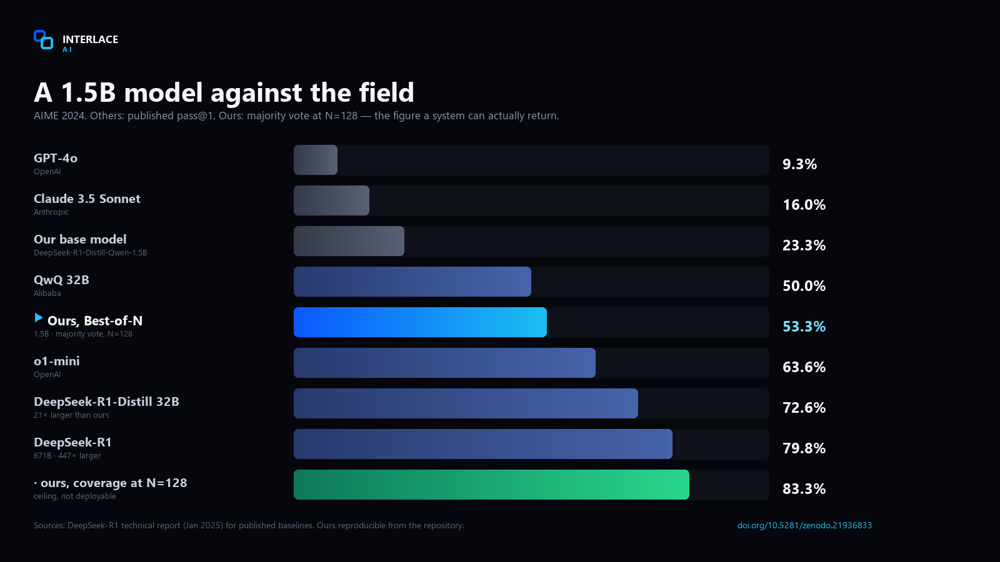

<div align="center">


**INTERLACE&nbsp;AI**

# Best-of-N

### Inference-time compute for any language model

**Sample N reasoning trajectories from a frozen model and select the best one.**
No weights are modified. All gains come from *how* the model is used.

Works with **any causal LM** and **any N** — you configure both.

[](https://pypi.org/project/bestofn/)
[](https://doi.org/10.5281/zenodo.21936833)
[](LICENSE)
[](tests/test_selectors.py)

```bash
pip install bestofn
```

</div>

---

## What it does

A language model does not produce *an* answer. It produces a **distribution over
answers**, and generating text draws one sample from it. Ask the same question
twice at non-zero temperature and you can get two different results.

That variability is usually treated as a nuisance. Best-of-N treats it as a
resource.

Suppose a model solves a given problem correctly 30% of the time. Ask once and
you are right 30% of the time. Ask 32 times and the probability that **at least
one** attempt is correct is `1 − 0.7³² ≈ 99.99%`. The knowledge is there; a
single sample just fails to retrieve it reliably.

So the problem splits in two:

| | |
|---|---|
| **Coverage** | Did any of the N attempts get it right? `1 − (1−p)^N` |
| **Selection** | Did we manage to pick that one out of the N? |

This library implements both halves: sampling N trajectories, and four different
ways of choosing between them.



Against published results from other laboratories. Ours is majority vote at
N=128 — the figure a system can actually return; the others are their published
pass@1. Coverage is shown separately and labelled as a ceiling.


Measured on `DeepSeek-R1-Distill-Qwen-1.5B`, **AIME 2024**, weights untouched:

| N | Majority vote | Coverage (pass@N) |
|---:|---:|---:|
| 1 | 23.3% | 23.3% |
| 8 | 40.0% | 60.0% |
| 32 | 50.0% | 73.3% |
| **128** | **53.3%** | **83.3%** |


And across domains:

| Benchmark | N | Single sample | Majority vote | Δ |
|---|---:|---:|---:|---:|
| AIME 2024 | 128 | 23.3% | **53.3%** | +30.0 |
| GPQA-Diamond | 32 | 33.8% | **43.4%** | +9.6 |
| GSM8K | 4 | 87.2% | **92.8%** | +5.6 |

All three are majority vote — the selector you would actually deploy. AIME
coverage at N=128 is higher (83.3%) but is a ceiling, not a returnable result.

### How a call works

1. **Generate.** N reasoning trajectories are sampled in parallel from the frozen
   model at `temperature > 0`, so each explores a different path.
2. **Extract.** The final answer is pulled out of each trajectory (by default the
   last `oxed{...}`) and normalised, so `"204"`, `"204.0"` and `" 204 "` count
   as the same answer.
3. **Select.** A selector decides which answer to return — by frequency, by the
   model's own confidence, or by an external verifier's score.
4. **Return.** You get the answer plus every sample, so you can inspect them or
   apply a different selector for free.

---

## Quickstart

```python
from bestofn import BestOfN

engine = BestOfN("deepseek-ai/DeepSeek-R1-Distill-Qwen-1.5B", n=32)

result = engine.solve("What is the remainder when 7^100 is divided by 13?")
print(result.answer)
print(result.agreement)     # how much the 32 samples agreed
```

Any model, any N:

```python
BestOfN("Qwen/Qwen2.5-Math-7B-Instruct", n=64)
BestOfN("meta-llama/Llama-3.1-8B-Instruct", n=16)
BestOfN("/path/to/your/local/model", n=128)
```

Install:

```bash
pip install bestofn
```

Plus a backend to run the model with:

```bash
pip install torch transformers   # works everywhere
pip install vllm                 # recommended; required for large N
```

---

## The selection gap

Look at the table above again. At N=128 the model **reaches** the right answer
83.3% of the time, but majority voting only **returns** it 53.3% of the time.


That 30-point difference is the **selection gap** — the correct answer was
generated and then discarded, because it was in the minority.

Majority voting cannot fix this: it is structurally incapable of choosing an
answer most trajectories disagree with. A learned verifier can.

| Selector (N=32, 90 AIME problems) | Accuracy |
|---|---:|
| Self-certainty | 18.9% |
| Majority vote | 35.6% |
| Verifier — argmax trajectory | 43.3% |
| **Verifier — confidence-weighted vote** | **52.2%** |

```python
def my_verifier(problem: str, trajectory: str) -> float:
    return probability_it_is_correct        # 0.0 – 1.0

engine = BestOfN(model, n=32, verifier=my_verifier)
engine.solve(problem, method="verifier")     # +16.6 points over majority
```

---

## Selectors

| Method | Needs | Recovers a minority-correct answer? |
|---|---|:---:|
| `majority` | nothing | No |
| `self_certainty` | log-probs (automatic) | Rarely |
| `verifier` | a verifier callable | **Yes** |
| `verifier_argmax` | a verifier callable | Yes, but noisier |
| `oracle` | the gold answer | Diagnostic ceiling only |

Generation is the expensive part — reusing the samples with another selector is free:

```python
r = engine.solve(problem, n=32)
r.answer                          # majority
r.select_with("self_certainty")
r.covered(gold)                   # was the answer reachable at all? (pass@N)
```

---

## Configuration

```python
BestOfN(
    model="deepseek-ai/DeepSeek-R1-Distill-Qwen-1.5B",
    n=32,                  # your compute budget
    temperature=0.6,       # must be > 0
    top_p=0.95,
    max_tokens=8192,
    extractor="boxed",     # boxed | number | letter | regex | your callable
    backend="auto",        # auto | vllm | transformers
    verifier=None,
)
```

**Full documentation: [USAGE.md](USAGE.md)** — how to choose N, how to plug in a
verifier, how to measure the selection gap on your own task, and the failure
modes worth knowing about.

---

## Verification

The published numbers are not asserted, they are replayed. This repository ships
the trajectories that produced them and a script that feeds them back through
the library:

```bash
python tests/verify_against_measured.py
```

```
Samples per problem (N)          : 32
  majority selection reproduced  : 30/30  (100.0%)
  majority vote, this library    : 63.3%   [recorded run: 63.3%]
  coverage pass@32                 : 76.7%
  gain from Best-of-N            : +31.7 points
PASS - reproduces the published measurements exactly
```

> **Why 63.3% here and 53.3% in the tables above?** They are two independent runs
> of the same benchmark. AIME has only 30 problems, so a single run carries a
> standard error of roughly 9 points; our two runs differ by 13 points at N=32
> (63.3% vs 50.0%). The tables quote the **more conservative** run. This script
> replays the other one, which is the set of trajectories shipped in `tests/`.
> Both are real measurements — the spread is what a 30-problem benchmark looks
> like, and it is worth knowing before comparing any single AIME figure against
> another lab'"'"'s.

Plus 45 unit tests covering extraction, normalisation, every selector, the
minority-rescue mechanism and error handling — no GPU required:

```bash
python tests/test_selectors.py     # 45 passed, 0 failed
```

---

## When this helps, and when it does not

**Good fit**

- Problems with a single comparable final answer: maths, multiple choice, short
  factual questions, unit-testable code.
- A model that is *sometimes* right. The gain is largest when per-sample accuracy
  sits in the middle — around 20–60%.
- Accuracy matters more than latency, and you can afford N generations.

**Poor fit**

- Open-ended generation — essays, summaries, chat. There is no well-defined vote
  over free text.
- Problems the model never solves. If `p = 0`, then `1 − (1−p)^N = 0` for every
  N: sampling more changes nothing.
- Problems the model always solves. Nothing to recover; you are paying N times
  for the same answer.
- Hard latency budgets. Cost scales linearly with N.

Not sure which case you are in? Measure it:

```python
results = engine.solve_batch(problems, n=32)
selected  = sum(r.answer == g for r, g in zip(results, golds)) / len(golds)
reachable = sum(r.covered(g)  for r, g in zip(results, golds)) / len(golds)
print(f"selected {selected:.1%} · reachable {reachable:.1%} · gap {reachable-selected:.1%}")
```

A large gap means invest in a verifier. Low coverage means you need a better
base model, not more samples.

---

## Limitations

- **Coverage is a hard ceiling.** If the model never generates the correct
  answer, no selector recovers it: `1 − (1−p)^N` is 0 for every N when p = 0.
- **Cost is linear in N.** N=128 means 128 generations. Use `vllm`.
- **Needs an extractable answer.** Built for tasks with a comparable final
  answer. Open-ended generation has no well-defined vote.
- **Verifier errors amplify.** The selector is bounded by its verifier.

---

## Prior work

Best-of-N sampling and verifier-based reranking are established techniques. This is an open
implementation with published measurements, not a new method:

- Cobbe et al., *Training Verifiers to Solve Math Word Problems*, 2021 — verifier reranking of N samples
- Wang et al., *Self-Consistency Improves Chain of Thought Reasoning*, 2022 — majority voting over samples
- Lightman et al., *Let'''s Verify Step by Step*, 2023 — process vs outcome supervision
- Snell et al., *Scaling LLM Test-Time Compute Optimally*, 2024 — compute vs parameters
- Brown et al., *Large Language Monkeys*, 2024 — coverage scaling with repeated sampling

Full discussion and references in [the technical report](https://doi.org/10.5281/zenodo.21936833).

---

## Citation

```bibtex
@techreport{arecesrivera2026interlace,
  title  = {Modern Architecture On Advanced LLM: Best-of-N Sampling,
            Learned Verification and Tree Search as a Substitute for Parameter Scale},
  author = {Areces Rivera, Alejandro},
  year   = {2026},
  number = {TR-2026-01},
  institution = {Interlace AI},
  doi    = {10.5281/zenodo.21936833}
}
```

Technical report: [doi.org/10.5281/zenodo.21936833](https://doi.org/10.5281/zenodo.21936833)
Code and raw outputs: [github.com/.../Interlace-AI/best-of-n](https://github.com/voidlinestudios12-jpg/Interlace-AI/tree/main/best-of-n)

---

## License

**Apache License 2.0** — free to use, modify and redistribute, including
commercially. Use it with any model, at any N, in any project.

Copyright 2026 Alejandro Areces Rivera — Interlace AI

Questions and collaboration: `interlaceIA@gmail.com`
